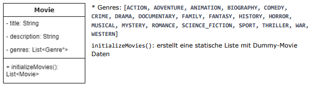

## Mirrored Template for Exercise 1
The Goal of this Exercise is to have a functioning Movie Database for the FH Movie Database - with dummy data in the beginning implemented directly into the code structure.
## K.O. Criteria are the following:
  .) The Project has to have a GUI showing the database movies 
  .) The Project has to have proper JUnit Testing, possible to start directly from Maven 
  .) The Project has to be based on Maven 
  .) The Project has to be done in GitHub with all the Project teammembers set as Contributors 

## Following Tasks have to be done:
  .) Create the dummy database with a few movies to pick from and work with 
   >   .) The methods name is initializeMovies() and returns a List of Movie Objects
> 
> The Movie object consists of following attributes:
> 
      
  .) Make sure the movies are shown in the correct order from the beginning (shown on the screen with the Sort Button)
   >   .) Pressing the Sort Button has to go From Ascended to Descended and back (with each press) 
   >   .) Sorting algorithm is updated via the title of the movie
      
  .) Implement the Feature to Search the Database with a String according to the Exercise Sheet
  >  .) The search has to be updated continously after pressing a button or writing something in the text field 
  >  .) The search query has to be inside the title and/or inside the description 
  >  .) The search query is NOT case sensitive
      
  .) Implement the feature to filter the Database with a Genre according to the Exercise Sheet
   >   .) The filtering logic can only work after pressing the button on the right 
   >   .) Filtering can be undone (option to none in the Dropdown menu or deactivate the filter somehow)
      
  .) Have a logic that updates the given movies, filtered and searched for, on the screen (view)

  .) Implement a Testing Logic for every method / at least 90% Code Coverage
  >    .) Testing the individual sorting, searching and filtering algorithms is mandatory 
  >    .) JUnit Tests can be automatically started with maven (mvn test) - implementing the habit to do so (internet)

## Coding Conventions:
  .) Naming Conventions are in English, camelCase is mandatory 
  .) Beware of method/function names and variables - state that it is clear what the variable does or the function/method 
  .) Write JavaDoc commentary for methods to ensure clear aspect
      

## Start the application
Start the application by either running the `main` method in the `FHMDbApplication` class.
